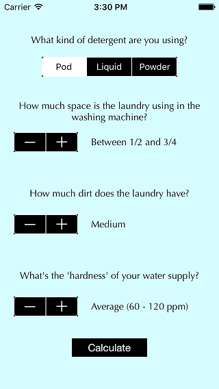

# DETERGO
## Interactive iOS App by Gregory Desrosiers

This open-source project is the counterpart iOS App of the DETERGO Ruby-based script; it lets you get an estimate of how much laundry detergent you need to wash your load right through your phone for usability. By using this, you'll get a better idea of how much detergent you need, whether it's pods, liquid, or powder, based on how much laundry you have, how much dirt you have, and how your water supply is.

## How do I use it?

This repo does not come with an iOS app file that you can download from here and install it on your device. Instead, you need to download this entire repository, run Xcode, and open up the project file (Detergo (Dev App).xcodeproj) to be used with Xcode.

This app has been programmed using Apple Swift 2.2, and put together using Xcode 7.3.1. If you have a more recent version of Swift, you'll need to let Xcode convert the syntax in the code for compatibility.

Once you do that, either run it on the simulator, or set up the project configuration to test run it on your iOS device if you have one. [Click here to see how.](https://developer.apple.com/library/content/documentation/IDEs/Conceptual/AppDistributionGuide/TestingYouriOSApp/TestingYouriOSApp.html) (You'll need an Apple ID profile and let XCode install a provisioning profile on your device in order to run the app on that device.)

## What's currently on this project?

This is a one-screen app where all you have to do is select your type of detergent, select drum capacity usage, amount of dirt, and water hardness, tap on Calculate, and read what the alert says. Then you can use that amount, put it in your laundry load, wash it, and see how it turns out.

Some inspiration and calculation has been considered while this app has been programmed; one of the influences is the water hardness level based on a chart provided by the US Environmental Protection Agency.

[Click here to see how this was built.](http://gregpdessch.github.io/blogs/detergo.html)

## Resources used in designing the project
Some inspiration has been drawn from the following pages:  
https://tide.com/en-us/how-to-wash-clothes/how-to-do-laundry/how-much-detergent-to-use  
https://tide.com/en-us/how-to-wash-clothes/how-to-do-laundry/how-do-i-know-load-size-for-my-washing-machine  
http://www.water-research.net/index.php/water-treatment/tools/hard-water-hardness  
https://www.fcwa.org/water/hardness.htm  

I also had inspiration into this project from a bottle of Arm & Hammer Essentials laundry detergent.

**NOTE: This project / repository is licensed under the MIT License. Please review the LICENSE file in this repo for details.**

Please leave some comments / questions here! This is truly open-source, so take this project and make extensions as you like!

###### Original Source Code and Design © 2017 Gregory Desrosiers. This project is not affiliated with EXPO DETERGO S.R.I., Rivista Detergo, Detergo Magazine, nor any other company that has "Detergo" as part of the company name.
###### https://gregpdessch.github.io
